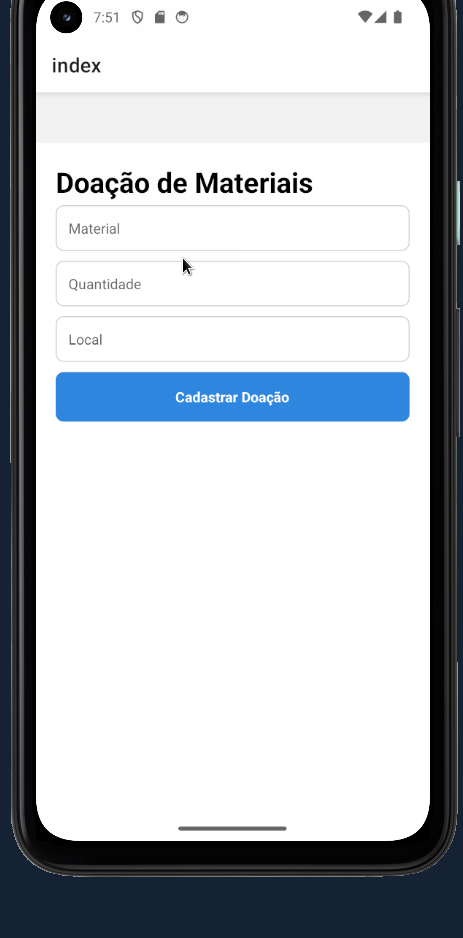
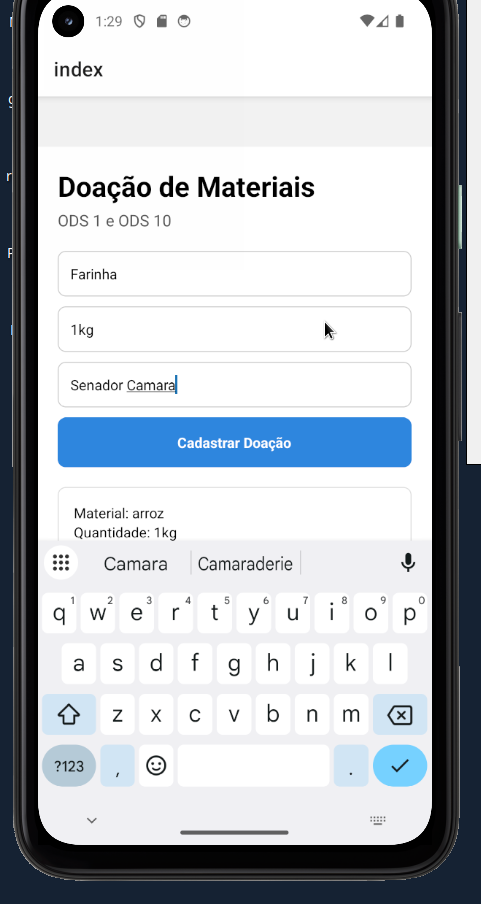

# Doacao-de-Alimentos-React-Native

Aplicação para o projeto de Extensão Universitária 2 que cobre as ODS 1 e 2.

&nbsp;

&nbsp;

## Fluxo Basico de Utilização
Para cada material recolhido no dia, será adicionado a lista de doações local do dispositivo, que
no fim do dia deverá ser avaliado pela instituição e adicionado a base de dados da igreja ou ong.

  
  &nbsp;&nbsp;
  
  &nbsp;&nbsp;
  

